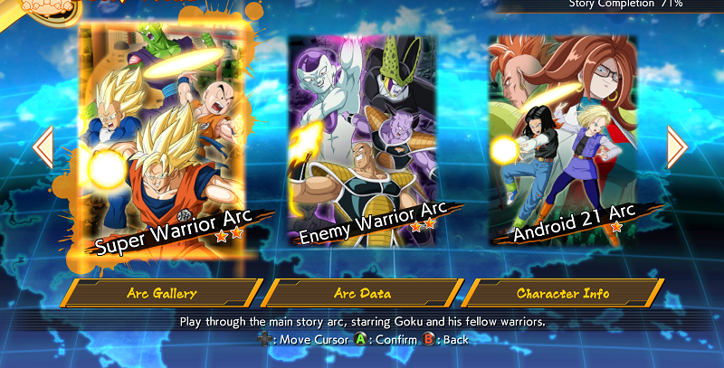

# Dragon-Ball-FighterZ-Zeni-Script

Script to automatically collect Zeni to help with the achievement [Set for Life](https://www.trueachievements.com/a246977/set-for-life-achievement) which is to collect <b>$20,000,000</b> Zeni

The script works by fighting <b>Piccolo</b> in <b>Story Android 21 Arc Hard Mode Chapter 8 Map 14</b> repeatedly.

The amount of zeni you earn will vary, but it should be about <b>$6,000</b> per fight if setup properly.

Each fight takes a little over 2 minutes so this script earns about <b>$160,000</b> Zeni per hour automatically.


## Prerequisites

- This script requires a very specific setup. To see detailed instructions on that setup click [Setup](setup.md)

## Getting Started

- Once all of the setup is complete, Go to story mode and leave the selector on <b>Super Warrior Arc</b>



- Once your Dragon Ball FighterZ application is setup like the screenshot above and all the steps in [Setup](setup.md) is complete, alt-tab to this program and run the script.
```sh
python main.py
```
- After this script is started, you have 15 seconds to alt tab back to <b>Dragon Ball FighterZ</b> and it will run until stopped


## Stopping the Script

The script is designed to run infinitely, but eventually you will want to stop it.

Unfortunately, the only way to stop the script right now is to alt-tab to the terminal running the script and mash <b>Control-C</b>

If you know of a more elegant way to stop the script, please create an issue or contact me.

## Tips

- Set the graphics settings to low to reduce the power you are using
- Play on Offline mode
- Run script overnight

## Installation

1. Clone the repo
```sh
git clone https://github.com/nolanwinsman/Dragon-Ball-FighterZ-Zeni-Script.git
```

# Contact

Nolan Winsman - [@Github](https://github.com/nolanwinsman) - nolanwinsman@gmail.com

Project Link: [https://github.com/nolanwinsman/Dragon-Ball-FighterZ-Zeni-Script](https://github.com/nolanwinsman/Dragon-Ball-FighterZ-Zeni-Script)

# Contributers
- nolanwinsman

## Files

- main.py   : main script to execute
- README.md : this file
- setup.md  : instructions on how to setup the game before running the script
- images    : folder of images used to visualise stuff
