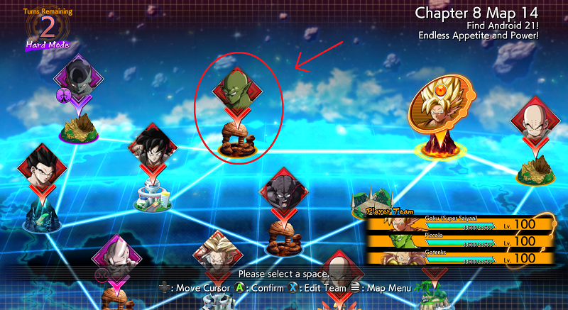
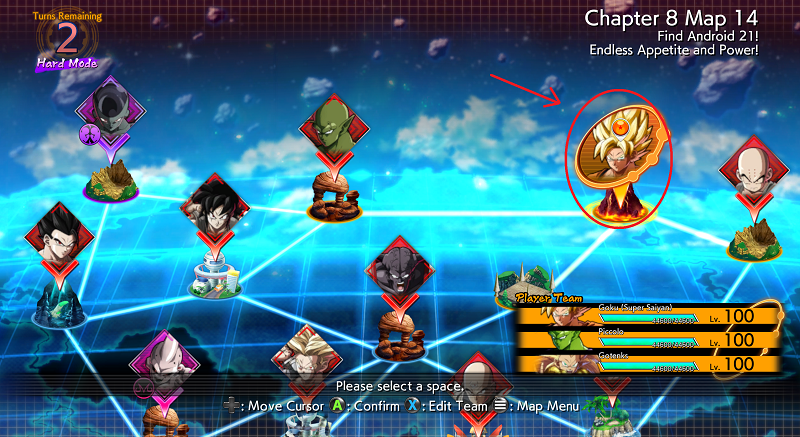

# Prerequisite Setup Before the Script Can Run

For a video guide, [click here](https://www.youtube.com/watch?v=N7uI18vyVcg&t=251s)

## Things to do before This Setup

- Beat The entire game on Hard mode
- Unlock three <b>Victory Zeni Up Lv. 6</b> Player Skills
- Have at least one character level 70+

## Steps

1. Go to the main story mode and choose <b>Android 21 Arc</b>
2. Go to Chapter 8 Map 14
3. Start the Piccolo fight

4. When you fight Piccolo, <b>DO NOT WIN THE FIGHT</b>
5. You want to get Picollo, Yamcha and Vegeta all to as low health as you can without defeating any of them
6. Once you get all the fighterz as low as possible, stop playing and let them win the fight
7. After you lose the fight, choose the three fighters you want to use for the script, does not really matter. They should be decently leveled though.
8. Now you want to increase Piccolo's level as much as you can 
9. To do this, move back and forth on empty spaces until you are about to run out of <b>Time Remaining</b> on the top left
10. Once you are almost out of <b>Time Remaining</b> Move to this spot where you are adjascent to Piccolo

11. Save and Quit

## Setup Complete

Go back to the [README](README.md) to run the script

## Notes
You never want to save and quit anymore on this screen. Always <b>Return to Story Mode Title Screen</b>

